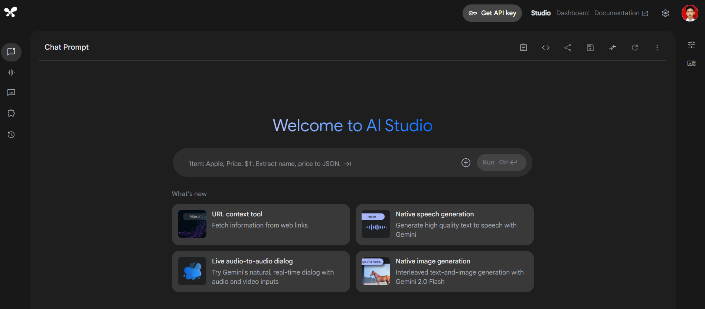
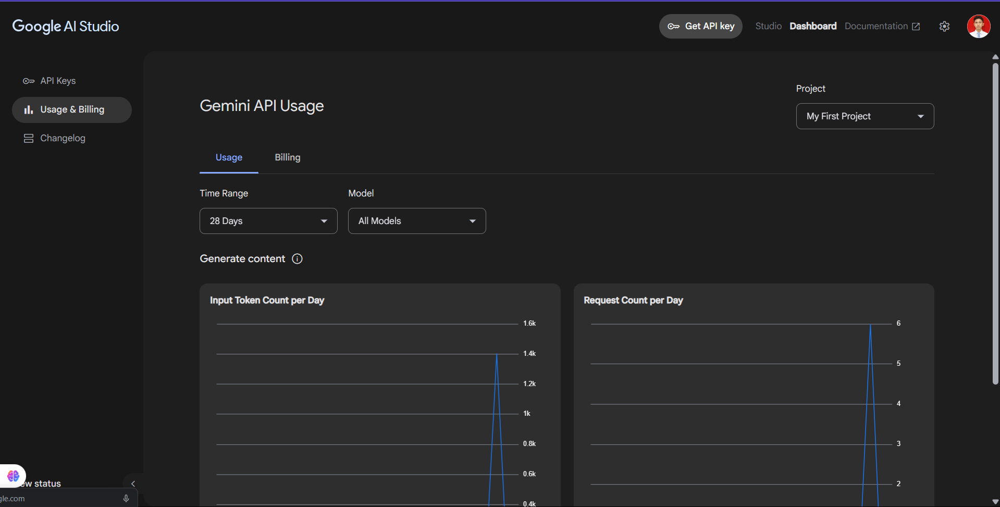
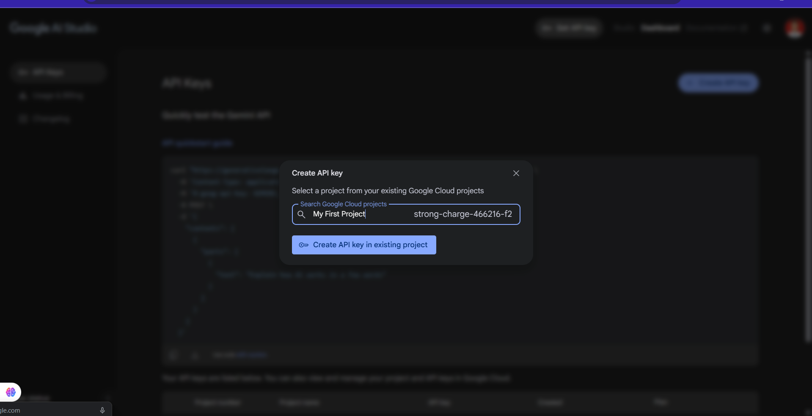
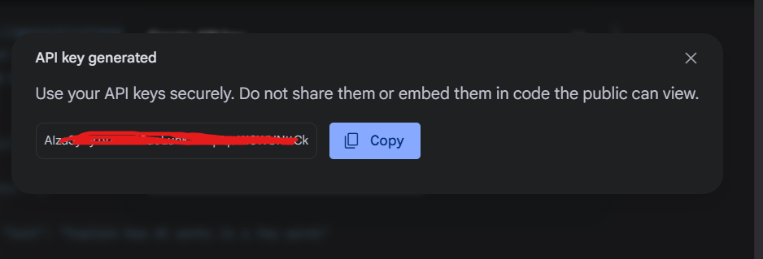
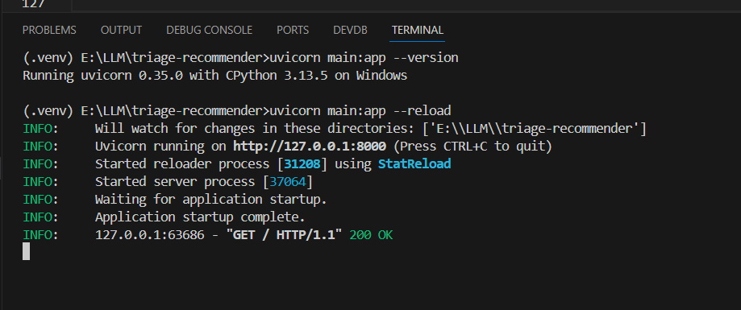
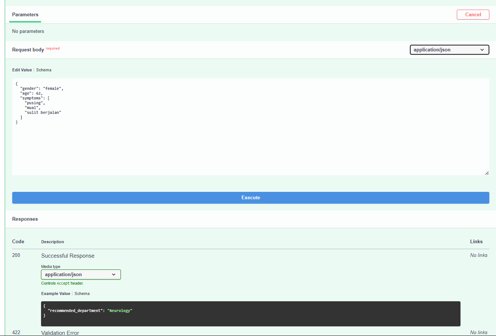
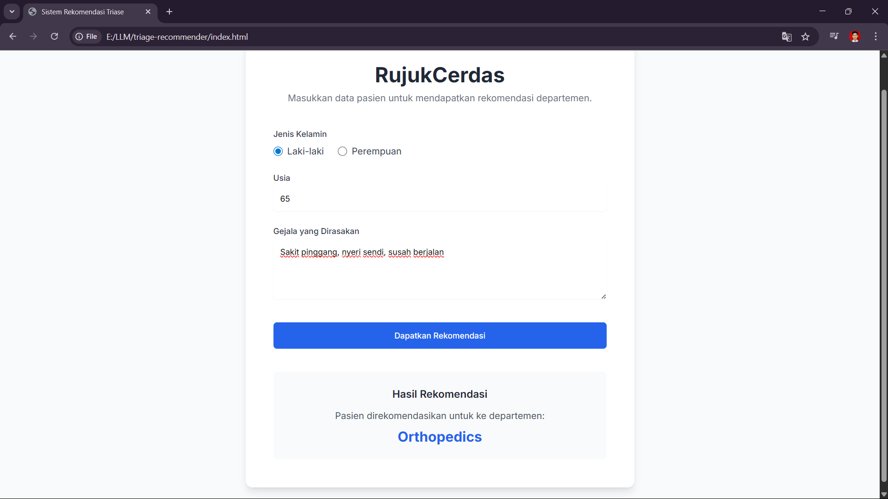

### Case 3: End-to-End Mini Project
### Name: Martin Ompusunggu
### Role: Associate AI Engineer Candidate

# RujukCerdas
Proyek ini adalah sebuah layanan API  yang dibangun menggunakan **FastAPI** untuk memberikan rekomendasi departemen rumah sakit berdasarkan gejala yang dimasukkan oleh pasien. Sistem ini memanfaatkan **Large Language Model (LLM)** dari Google melalui LangChain untuk menganalisis data dan memberikan rekomendasi berbasis AI.

## Tools/Frameworks
- Backend API: FastAPI
- Integrasi AI: LangChain, Google API, gemini-1.5-flash
- Frontend: HTML, CSS (Tailwind), dan JavaScript
- Validasi Data: Pydantic untuk memastikan integritas data yang masuk dan keluar.
- Dokumentasi Otomatis: Dokumentasi API tersedia di endpoint /docs.

## Additional Note
Ini merupakan informasi terkait file-file yang ada di proyek ini, antara lain:
- `main.py` = File berisi terkait kode program untuk mengakses FastAPI
- `index.html` = File berisi tampilan Front End
- `.env.example` = Setelah repo ini di Clone atau diunduh Anda harus mengganti menjadi `.env` dan memasukan API Key Google dengan tutorial dibawah ini yaa!

## 1. Persiapan (Prerequisites)
Pastikan perangkat telah terinstal:
### 1.1 Python (versi >= 3.8).
Pastikan versi Python yang terdapat perangkat sesuai dengan syarat **Versi Python >= 3.8**
### 1.2 Google AI API Key: 
Disini kita memerlukan API Key dari Google AI Studio dengan mengikuti langkah-langkah berikut: 
- Kunjungi [aistudio.google.com](aistudio.google.com) 
    

- Pilih button `Get API Key`
    

- Pilih menu `API Keys` lalu `Create API Key`, Selanjutnya akan muncul pop up menu untuk membuat/pilih project. Lalu create dan salin API key nya.
    - Gambar tampilan memilih proyek
    
    - Gambar tampilan Generate Key
    

## 2. Instalasi dan Setup
Berikut langkah-langkah untuk menyiapkan proyek di komputer.
### 2.1 Clone/Unduh ke direktori lokal
### 2.2 Buat dan Aktifkan Virtual Environment
Note: Disarankan untuk menggunakan virtual environment agar dependensi proyek tidak tercampur dengan instalasi Python global.
- Masuk ke folder proyek

        cd nama-folder-proyek

### 2.3 Buat virtual environment
    python -m venv .venv

### 2.4 Aktifkan virtual environment 
#### Windows:
    .venv\Scripts\activate
#### macOS/Linux:
    source .venv/bin/activate

Setelah diaktifkan, Anda akan melihat (.venv) di awal baris terminal Anda.
### 2.5 Instal Dependensi
Dengan virtual environment yang sudah aktif, instal semua paket yang dibutuhkan dari file `requirements.txt`.
    
    pip install -r requirements.txt

### 2.6 Siapkan API Key
Di dalam folder proyek, cari file bernama `.env.example.`
Buat salinan dari file tersebut dan ganti namanya menjadi `.env`.
Buka file `.env` yang baru, lalu masukkan API Key Google Anda.
File .env Anda akan terlihat seperti ini:
### Ganti placeholder dengan kunci API Google Anda yang valid
    GOOGLE_API_KEY="aIzaSyBxxxxxxxxxxxxxxxxxxxxxx_cdeFg"

## 3. Menjalankan FE + BE
### 3.1 Jalankan dan Akses Server Backend (FastAPI)
Pastikan terminal Anda berada di direktori utama proyek dan virtual environment sudah aktif.
Jalankan perintah berikut untuk menyalakan server:

    uvicorn main:app --reload

- Tampilan FastAPI Berjalan dengan Baik
    

Server sekarang berjalan di `http://127.0.0.1:8000`. Biarkan jendela terminal ini tetap terbuka.
- Jika Anda ingin melihat dokumentasi teknis dari API atau mengujinya secara langsung, buka alamat berikut di browser Anda:
        
        http://127.0.0.1:8000/docs

Disini bisa melihat detail endpoint /recommend dan bahkan mencobanya langsung dari antarmuka Swagger UI.

- Melakukan rekomendasi departements di FastAPI/Swagger UI dengan menggunakan `http://127.0.0.1:8000/docs` 
    - Pilih **Try it out**
    

    - Eksekusi JSON
    

    - Isi value JSON-nya gender(male/female), age, symptoms
    - Setelah itu `Execute`. Nanti hasil rekomendasi akan tampil di section `Responses`.

            Note: Pastikan API GOOGLE_API_KEY sudah terdefinisi di file .env
            
### 3.2 Web UI
- Gunakan exstension `Live Server` untuk menjalankan proyek atau salin Path file `index.html` lalu salin ke Web Browser(**pastikan FastAPI, API Key Google sudah berjalan dengan baik**).
- `index.html` akan terbuka di browser default Anda, dan Anda bisa langsung mengisi formulir untuk mendapatkan rekomendasi.
    
